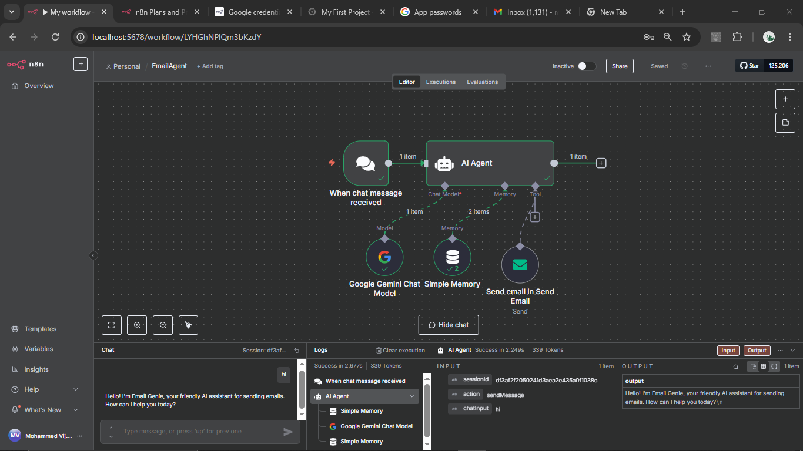

 """
# 🤖 AI-Powered Email Assistant using n8n + Google Gemini

This project showcases the creation of a smart and proactive AI Agent using [n8n](https://n8n.io) that intelligently understands user chat messages and sends well-structured emails using Google Gemini's powerful language capabilities.

---

## 🔧 Components Overview

- **Trigger:** `When Chat Message Received`
- **AI Agent:** Configured with:
  - `Google Gemini Chat Model` → Natural Language Understanding (NLU)
  - `Simple Memory` → Maintains conversation and context
  - `Send Email Tool` → Sends professionally formatted emails

---

## 🤖 AI Agent Persona: *Email Genie*

> You are **Email Genie**, a helpful, friendly, and efficient AI assistant.
> - Interpret user's natural chat messages.
> - Extract key email elements: recipient, subject, and body.
> - Ask for missing information if needed.
> - Use the "Send email" tool to dispatch the email professionally.

**Example Query:**
Send an email to john@example.com about the project meeting tomorrow at 3 PM.

yaml
Always show details

Copy

---

## 🧠 Workflow Diagram

Here is the AI Agent design within the n8n visual flow:

### 📸 Screenshot of Live n8n Workflow

---

## 🎥 Demo Video

👉 [Watch the Demo on Google Drive](https://drive.google.com/file/d/1X6ovRPQ0zWgQejIAU-poZjWYPfHoMkb7/view?usp=sharing)

---

## 💡 Example Inputs to Test

Try the following messages:

1. `Send an email to vijahath@gmail.com with subject "Update" and body "AI agent is now live!"`
2. `Email Raj at raj@example.com and tell him the demo is postponed.`
3. `Send an email to anjali@xyz.com`

---

## 🛠️ Technologies Used

- **n8n** – Visual automation platform
- **Google Gemini Chat Model** – Natural language chat processing
- **Simple Memory Node** – Persistent memory for context
- **SMTP / Send Email Tool** – For sending emails dynamically

---

## 🚀 Future Enhancements

- 📅 Scheduled or recurring email support
- 📥 Auto-replies and smart email threading
- 🧠 Contextual response templates based on email type
- 🔒 Secure OAuth-based email sending options

---

## 📂 Project Structure

.
├── README.md
├── docs/
│ ├── Screenshot (48).png
│ └── ai_agent_diagram.png
├── prompts/
│ └── ai_agent_prompt.txt

yaml
Always show details

Copy

---

## 🙌 Contribution & License

Feel free to fork or suggest improvements. Licensed under MIT.
"""
